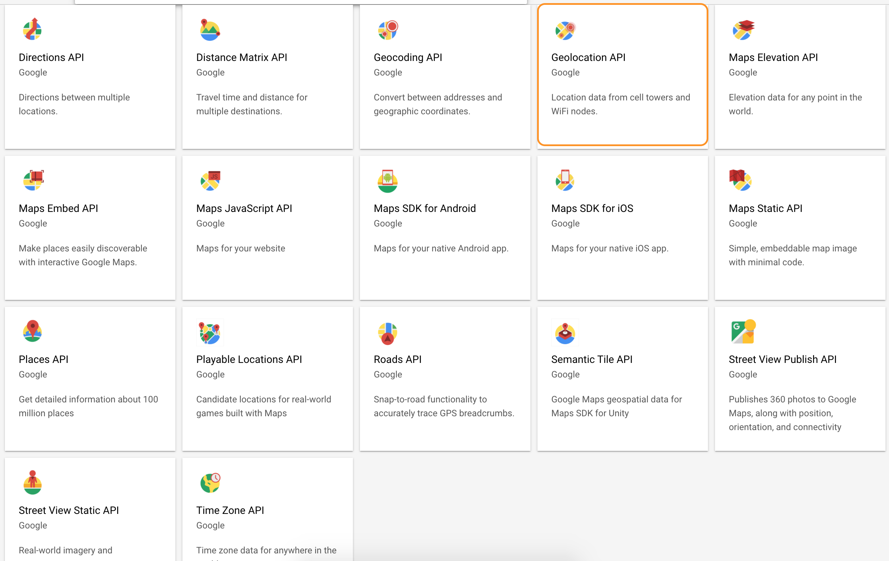

# Google maps API
- 
  
# React + Google Maps + GeoJson
- [Enable Google Map APIs Key](https://developers.google.com/maps/gmp-get-started#enable-api-sdk)
- https://medium.com/@dmw9400/using-geojson-with-google-maps-api-5127f7498a33
- https://tomchentw.github.io/react-google-maps/
  

```sh

```


## Examples
- https://react-google-maps-api-gatsby-demo.netlify.app/


# GeoJson
- https://geoman.io/