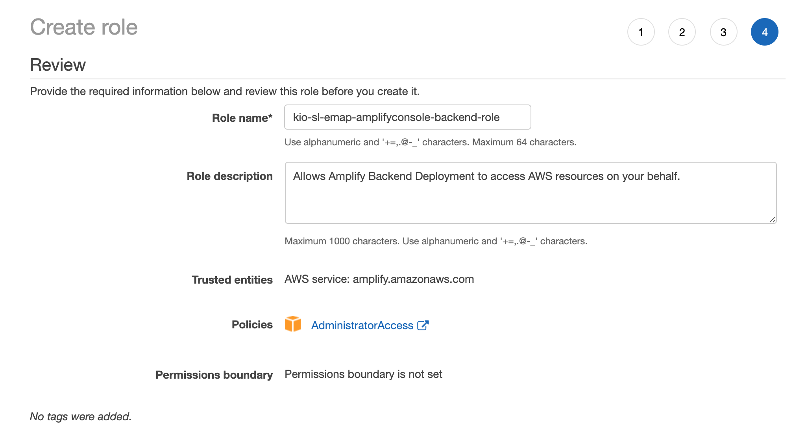
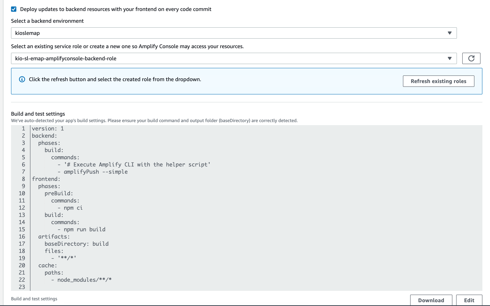

# Amplify
- [docs.amplify.aws](https://docs.amplify.aws/cli/hosting#using-aws-amplify-console)
- 
# amplify configure

```sh
amplify configure
```
## result
```sh
https://console.aws.amazon.com/
Press Enter to continue

Specify the AWS Region
? region:  us-east-1
Specify the username of the new IAM user:
? user name:  kio-sl-emap
Complete the user creation using the AWS console
https://console.aws.amazon.com/iam/home?region=undefined#/users$new?step=final&accessKey&userNames=kio-sl-emap&permissionType=policies&policies=arn:aws:iam::aws:policy%2FAdministratorAccess
Press Enter to continue

Enter the access key of the newly created user:
? accessKeyId:  AKIAVMIQWZ**********
? secretAccessKey:  Vg9H5zcFgSzt7bkKcISi********************
This would update/create the AWS Profile in your local machine
? Profile Name:  kio-sl-emap
```

# amplify init

```sh
amplify init
```

## result
```sh
Note: It is recommended to run this command from the root of your app directory
? Enter a name for the project kio-sl-emap
? Enter a name for the environment kioslemap
? Choose your default editor: Visual Studio Code
? Choose the type of app that you're building javascript
Please tell us about your project
? What javascript framework are you using react
? Source Directory Path:  src
? Distribution Directory Path: build
? Build Command:  npm run-script build
? Start Command: npm run-script start
Using default provider  awscloudformation

For more information on AWS Profiles, see:
https://docs.aws.amazon.com/cli/latest/userguide/cli-multiple-profiles.html

```

## result
```sh
? Do you want to use an AWS profile? Yes
? Please choose the profile you want to use kio-sl-emap
Adding backend environment kioslemap to AWS Amplify Console app: d3gdir69o49796
⠼ Initializing project in the cloud...

CREATE_IN_PROGRESS AuthRole                             AWS::IAM::Role             Fri Jan 15 2021 10:06:14 GMT-0500 (Colombia Standard Time) Resource creation Initiated
CREATE_IN_PROGRESS DeploymentBucket                     AWS::S3::Bucket            Fri Jan 15 2021 10:06:13 GMT-0500 (Colombia Standard Time) Resource creation Initiated
CREATE_IN_PROGRESS UnauthRole                           AWS::IAM::Role             Fri Jan 15 2021 10:06:13 GMT-0500 (Colombia Standard Time) Resource creation Initiated
CREATE_IN_PROGRESS AuthRole                             AWS::IAM::Role             Fri Jan 15 2021 10:06:13 GMT-0500 (Colombia Standard Time)                            
CREATE_IN_PROGRESS UnauthRole                           AWS::IAM::Role             Fri Jan 15 2021 10:06:13 GMT-0500 (Colombia Standard Time)                            
CREATE_IN_PROGRESS DeploymentBucket                     AWS::S3::Bucket            Fri Jan 15 2021 10:06:13 GMT-0500 (Colombia Standard Time)                            
CREATE_IN_PROGRESS amplify-kio-sl-emap-kioslemap-100604 AWS::CloudFormation::Stack Fri Jan 15 2021 10:06:08 GMT-0500 (Colombia Standard Time) User Initiated             
⠸ Initializing project in the cloud...

CREATE_COMPLETE AuthRole   AWS::IAM::Role Fri Jan 15 2021 10:06:28 GMT-0500 (Colombia Standard Time) 
CREATE_COMPLETE UnauthRole AWS::IAM::Role Fri Jan 15 2021 10:06:27 GMT-0500 (Colombia Standard Time) 
⠙ Initializing project in the cloud...

CREATE_COMPLETE DeploymentBucket AWS::S3::Bucket Fri Jan 15 2021 10:06:34 GMT-0500 (Colombia Standard Time) 
⠴ Initializing project in the cloud...

CREATE_COMPLETE amplify-kio-sl-emap-kioslemap-100604 AWS::CloudFormation::Stack Fri Jan 15 2021 10:06:37 GMT-0500 (Colombia Standard Time) 
✔ Successfully created initial AWS cloud resources for deployments.
✔ Initialized provider successfully.
Initialized your environment successfully.

Your project has been successfully initialized and connected to the cloud!

Some next steps:
"amplify status" will show you what you've added already and if it's locally configured or deployed
"amplify add <category>" will allow you to add features like user login or a backend API
"amplify push" will build all your local backend resources and provision it in the cloud
“amplify console” to open the Amplify Console and view your project status
"amplify publish" will build all your local backend and frontend resources (if you have hosting category added) and provision it in the cloud

Pro tip:
Try "amplify add api" to create a backend API and then "amplify publish" to deploy everything
```

# amplify hosting

```sh
amplify add hosting
```
## AWS Config
- 
- 

## result
```sh
? Select the plugin module to execute Hosting with Amplify Console (Managed hosting with
 custom domains, Continuous deployment)
? Choose a type Continuous deployment (Git-based deployments)
? Continuous deployment is configured in the Amplify Console. Please hit enter once you 
connect your repository 
Amplify hosting urls: 
┌──────────────┬──────────────────────────────────────────────┐
│ FrontEnd Env │ Domain                                       │
├──────────────┼──────────────────────────────────────────────┤
│ master       │ https://master.d3gdir69o49796.amplifyapp.com │

```

